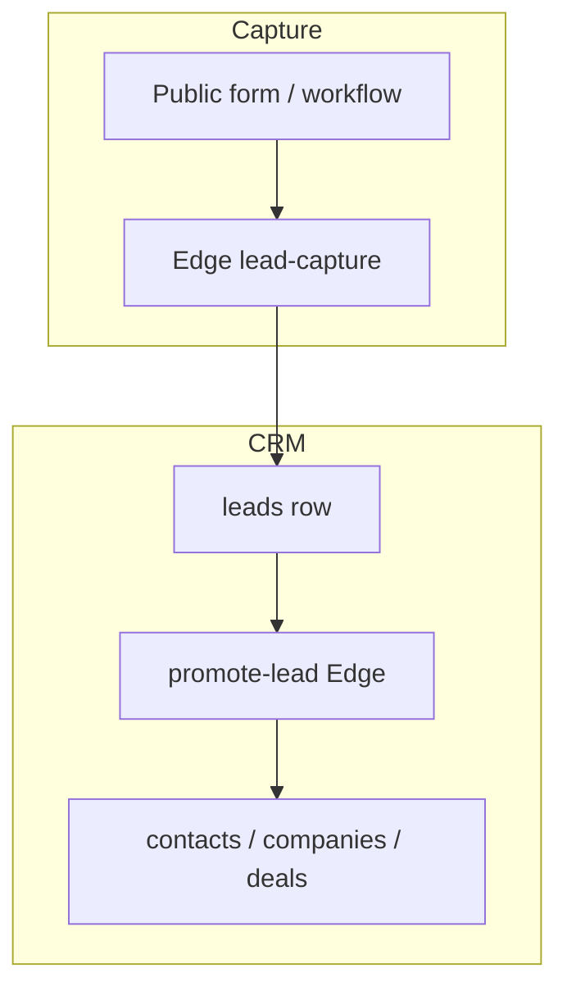

# Lead capture (public endpoint)

## Overview

Unauthenticated prospects can submit a form that creates a **lead** in the correct organization. Secrets are **opaque tokens** (`lct_…`) created by admins; only a **hash** is stored (`lead_capture_tokens`).

## Lead lifecycle (high level)

- Inbound capture is org-scoped (token / org id) and rate-limited at the Edge layer.
- **Promote** is idempotent: a lead already converted should not create duplicate CRM rows (see `supabase/functions/promote-lead`).

## Admin flow

1. Authenticated user calls the `lead-capture-tokens` Edge Function (`action`: `create` | `list` | `delete`) with `organizationId`.
2. On `create`, the plaintext token is returned **once** (same pattern as API keys).
3. Embed the token in a hidden field on your public site.
4. `delete` is idempotent and returns `200` with `deleted: true|false` to keep retries safe.

## Public POST (`lead-capture`)

- **POST** `.../functions/v1/lead-capture` with JSON body:
  - `token` (required): full `lct_…` string
  - `first_name`, `last_name`, `email` (required)
  - `phone`, `company_name`, `notes` (optional)
  - `website` (honeypot): must be empty — bots that fill all fields are ignored with a silent 200.

## Spam and CSP

- Use a honeypot field (`website`) and optionally rate-limit at the edge or CDN.
- If the form is embedded on another origin, configure **CORS** on your hosting; the Edge Function allows `Access-Control-Allow-Origin: *` for simple integrations.

## Duplicate emails

- `leads` enforces unique email per organization. Duplicate submissions return `{ ok: true, duplicate: true }` without error.

## Error contract and support workflow

- Token management endpoints (`lead-capture-tokens`) return standardized errors:
  - `{ error, code, status, request_id }`
- Public endpoint (`lead-capture`) also includes `request_id` in responses for log correlation.
- Common statuses:
  - `401`: invalid/disabled token or invalid session for token management.
  - `403`: user lacks organization permissions for token mutations.
  - `400`: validation issue (missing fields, malformed payload).

## Cross-links

- Lead scoring and lifecycle: [`master-lead-management.md`](./master-lead-management.md)
---

*Last updated (git): **2026-05-15***
