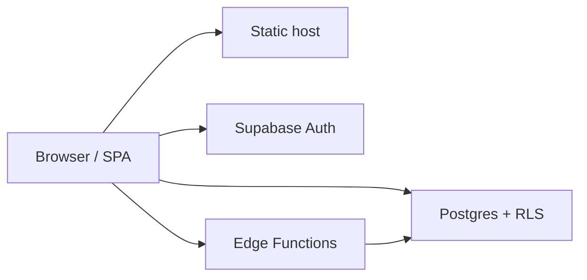

# Project state: two layers of truth

This file **bridges** the long-form product/engineering docs in `docs/master-*.md` and the **milestone tracker** under [`.planning/`](../.planning/) (phases, `DEPLOY-*` requirements, `STATE.md`).

## When to read what

| Need | Primary source | Notes |
|------|----------------|--------|
| **Who owns each open `[ ]` cluster** (code vs ops vs legal vs evidence) | [Checkbox ownership matrix](#checkbox-ownership) (this file) | Matrix for masters, REQUIREMENTS, and phase validations. |
| v1.0 phase completion, next phase gate, session notes | [`.planning/STATE.md`](../.planning/STATE.md), [`.planning/ROADMAP.md`](../.planning/ROADMAP.md) | Engineering milestone view (Phases 1–10). |
| Checked requirements IDs (`AUTH-*`, `DEPLOY-*`, …) | [`.planning/REQUIREMENTS.md`](../.planning/REQUIREMENTS.md) | Single checklist for v1 scope. |
| **Pro** roadmap (30/60/90), execution backlog, GTM matrix | [`master-roadmap-backlog.md`](./master-roadmap-backlog.md) | Product horizon beyond the v1 phase list. |
| Pipedrive parity, webhooks/API spec, group killer gaps | [`master-pipedrive-velo-comparison.md`](./master-pipedrive-velo-comparison.md) | Benchmark + v1 webhook acceptance criteria + interview template. |
| What shipped, in narrative form (Parts A + B) | [`master-implementation-history.md`](./master-implementation-history.md) | Archive-stable Part A; active Part B (sections 13–28). |
| Go-live, QA matrices, production handoff | [`master-release-qa.md`](./master-release-qa.md) | Especially [Production handoff checklist](master-release-qa.md#production-handoff-checklist). |
| Auth/SSO contracts, evidence index, Supabase external checklist | [`master-security-compliance.md`](./master-security-compliance.md) | Includes OAuth redirect / CORS reminders. |
| Lead maintenance jobs, retention, ops | [`master-lead-management.md`](./master-lead-management.md) | Edge function `lead-score-maintenance`, runbooks. |
| Resend/DNS, mailbox privacy, email smoke | [`master-email-operations.md`](./master-email-operations.md) | Deliverability + release gates for mail. |
| Layout shells, navigation, profile display names | [`master-design-ui.md`](./master-design-ui.md) | UI conventions for new screens. |

**Rule of thumb:** if the question is *“is v1 Phase 10 done?”* start in **`.planning/`**. If it is *“what do we build next for Pro?”* start in **`master-roadmap-backlog`**.

---

## v1 release / hosting (vendor-neutral)

`.planning/REQUIREMENTS.md` still lists `DEPLOY-01`–`DEPLOY-05` with example filenames from one host; the **intent** is:

1. **SPA routing** — every client-side route must resolve to the built `index.html` on cold load (configure the static host or reverse proxy accordingly). **Repo examples:** [`vercel.json`](../vercel.json), [`public/_redirects`](../public/_redirects) — explained in [`docs/deployment-spa-and-env.md`](./deployment-spa-and-env.md).
2. **Build-time env** — `VITE_APP_CHANNEL` when set is **`production`** or **`staging`** (otherwise inferred from Vite `MODE`; local dev → `development`); plus `VITE_SUPABASE_URL` and `VITE_SUPABASE_ANON_KEY` for real hosted builds. See [`src/lib/envChannel.ts`](../src/lib/envChannel.ts), [`src/lib/supabase.ts`](../src/lib/supabase.ts), and [`vite.config.ts`](../vite.config.ts). Canonical copy: [`docs/deployment-spa-and-env.md`](./deployment-spa-and-env.md) and [`.env.example`](../.env.example).
3. **Preview ↔ Supabase** — set **`VITE_APP_CHANNEL=staging`** on preview builds and point keys at a **non-production** Supabase project; add preview origins and OAuth redirects to Supabase Auth allowlists; optionally set Edge secret **`EDGE_CORS_ORIGINS`** so Edge CORS matches those origins (see [`deployment-spa-and-env.md`](./deployment-spa-and-env.md) · [`master-security-compliance.md` §3](./master-security-compliance.md#supabase-external-hardening-checklist)).
4. **Production pipeline** — deploy from protected `main` (or your release branch) with a recorded smoke pass — [`docs/smoke-checklist-production.md`](./smoke-checklist-production.md).
5. **Custom domain + TLS** — DNS and certificate as required by your provider.

**Google (Gmail/Calendar) operator setup + verification:** [`docs/google-gmail-oauth-verification.md`](./google-gmail-oauth-verification.md#operator-setup-google-oauth).

Operational detail for env vars and schedulers overlaps [`master-release-qa.md` — Production handoff](./master-release-qa.md#production-handoff-checklist).

---

## System context (high level)

- **Frontend:** React 18 + Vite + React Router + Zustand; hosted as a static SPA (rewrites to `index.html`).
- **Backend:** Supabase (Postgres + RLS, Auth, Realtime). **Edge Functions** (Deno) for webhooks, public API, lead capture, email/Gmail glue, etc.
- **Auth (summary):** `signInWithPassword` → session JWT; optional MFA challenge/verify via Supabase MFA.

---

## Key decisions (rolled up; Apr 2026)

- **Observability (browser):** Sentry initializes when `VITE_SENTRY_DSN` is set; UI error boundary captures exceptions; Edge uses structured request logging and can be extended with Edge Sentry when needed (`src/lib/sentry.ts`, `supabase/functions/_shared/requestLog.ts`).
- **MFA:** TOTP via `supabase.auth.mfa`; Settings → Security manages enrollment; login challenges when a second factor is required (`src/pages/Login.tsx`, `src/components/settings/SettingsMfaPanel.tsx`).
- **DSR / export:** `data-export` Edge function supports export summary and can queue ZIP/CSV jobs (`supabase/functions/data-export`).
- **Soft delete + retention:** core tables carry `deleted_at`; operators run scheduled purges via `purge-soft-deleted` (`.github/workflows/data-retention-purge.yml`, `supabase/functions/purge-soft-deleted`).
- **Outbound webhooks:** deliveries are outboxed; failures reach terminal **`dead`** state (DLQ semantics) after max retries (`supabase/functions/webhook-worker`).
- **Public API versioning:** `crm-public-api` responds with `X-API-Version: 1` and supports explicit v1 routing; idempotency is reserved for future write endpoints (`docs/public-api-phase1.md`, `supabase/functions/crm-public-api`).
- **Org roles:** custom roles tables exist but `has_org_permission()` is not yet wired to JWT claims; avoid depending on it in RLS until implemented (`supabase/migrations/20260427250000_organization_roles.sql`).
- **Email provider interface (SPA):** client-side provider contract may exist for composition/UI, but real sends remain server-side (Edge) for credential safety.

## Gaps (not fully owned by a single master today)

Track these explicitly until each is either implemented or moved into the right master.

| Gap | Why it matters | Where to track / fix |
|-----|----------------|----------------------|
| **Google Cloud: restricted-scope verification** (Gmail APIs for production users) | Long lead time (weeks); blocks trustworthy Gmail outside test users. **Incremental OAuth (Gmail then Calendar)** is implemented in repo + Edge; remaining work is mostly **Console + verification + product features** that use Calendar after scopes are granted. | [`.planning/STATE.md`](../.planning/STATE.md) Notes; operator + engineering backlog: [`google-gmail-oauth-verification.md` — Outstanding work](./google-gmail-oauth-verification.md#outstanding-google-integration); redirect URIs per origin in same doc; align Google Cloud OAuth client + Edge secrets + `gmail-oauth-exchange` / refresh flow. |
| **Org-wide member identity in UI** (email/name for peers) | Team pages and assignee pickers need an RLS-safe source beyond `organization_members` alone | **Shipped:** RPC `list_organization_members_with_identity` (migration `20260415120000_*`) + [`authStore.fetchOrgUsers`](../src/store/authStore.ts). Planning context: [`.planning/CODEBASE.md` (Concerns)](../.planning/CODEBASE.md#codebase-concerns). UX: [`master-design-ui.md` — User profile](./master-design-ui.md#user-profile-display-names). |
| **Email open/click “truth” for analytics** | Server path: Edge `track-open` / `track-click` → `email_tracking_events` (RLS per sender). **Reports** surfaces server counts for the signed-in user; org-wide manager rollups still future work. | [`.planning/CODEBASE.md` (Concerns)](../.planning/CODEBASE.md#codebase-concerns); [`master-implementation-history.md`](./master-implementation-history.md) Part A §6 + Part B §15–17; Reports UI + [`master-email-operations.md`](./master-email-operations.md). |
| **Residual research docs naming one host** | Older notes used a single vendor while `DEPLOY-*` intent is neutral | `.planning/research/deploy-testing.md` was **neutralized** (2026-04-16) and points to [`docs/deployment-spa-and-env.md`](./deployment-spa-and-env.md). Canonical DEPLOY wording remains `.planning/REQUIREMENTS.md` + Phase 10 in `ROADMAP.md`. |
| **Pipedrive / group integration parity** (outbound webhooks shipped; public REST phase 1 + Settings UI completion in flight) | Outbound webhooks + replay are in Supabase; public API keys / read API / lead capture need Edge deploy + UI wiring — see [`public-api-phase1.md`](./public-api-phase1.md), [`lead-capture-public-endpoint.md`](./lead-capture-public-endpoint.md), [`master-pipedrive-velo-comparison.md`](./master-pipedrive-velo-comparison.md). |
| **Open checklists without a clear owner** | Same `[ ]` interpreted as “dev debt” when it is ops or legal | **Matrix:** [Checkbox ownership](#checkbox-ownership) (below) |

---

## Checkbox ownership matrix

This section maps **unchecked `- [ ]` clusters** across `docs/master-*.md`, `.planning/ROADMAP.md` (phase “Done when”), and `.planning/REQUIREMENTS.md` to **who closes them** and **what kind of work** is required (code, dashboard, evidence, or legal). Use it so engineering does not chase ops-only rows, and ops does not wait on code for human evidence.

| Cluster / document | Typical IDs or rows | Owner | Close requires |
|--------------------|---------------------|-------|----------------|
| `.planning/REQUIREMENTS.md` — `AUTH-*`, `SEC-*`, product features | Auth flows, RLS, UI gates | Engineering | Code + tests; some rows need **Supabase dashboard** (Auth settings, URLs) |
| `.planning/REQUIREMENTS.md` — `DEPLOY-01`–`DEPLOY-05` | Static host, SPA rewrites, TLS, preview vs prod | Ops + Engineering | **Evidence** (host, channel, Supabase project, smoke result, commit) pasted per REQUIREMENTS template; not `[x]` without human sign-off |
| `docs/smoke-checklist-production.md` | Post-deploy smoke | Ops / release | **Manual run** + note in STATE or release ticket |
| `docs/master-release-qa.md` — Production handoff | Go/no-go matrices | PM + Ops + Eng | Mixed: code fixes vs **human QA** sign-off |
| `docs/master-security-compliance.md` | DSAR, SOC mapping, buyer checklist | Security / Legal + Ops | **Runbooks + evidence**; many rows are not repo code |
| `docs/master-email-operations.md` | DNS, Resend, deliverability | Ops | **Dashboard + DNS**; link evidence in masters when done |
| `docs/google-gmail-oauth-verification.md` | Google Cloud verification | Product + Ops + Eng | **Google Cloud / OAuth** console work + app updates |
| `.planning/ROADMAP.md` — “Done when” blocks | Manual SQL / verification expectations | Engineering + DBA | One-time **verify** then tick or mark **archived / not blocking** |
| `docs/master-roadmap-backlog.md` | SSO, webhooks v1, DSR, enterprise | Product | **Roadmap slices**; do not flatten into one sprint |

### FR / DE / IT locales

The app ships **EN** (source), **ES**, and **PT** with full catalogs. **FR, DE, IT** (when present) intentionally **spread English** keys until native strings are added: parity is enforced by `npm run i18n:lint` on changed files; do not block releases on FR/DE/IT native copy unless product prioritizes those locales.

### Related links

- Deploy intent (vendor-neutral): [`deployment-spa-and-env.md`](./deployment-spa-and-env.md)
- Milestones: [`.planning/ROADMAP.md`](../.planning/ROADMAP.md) · [`.planning/STATE.md`](../.planning/STATE.md) · [`.planning/REQUIREMENTS.md`](../.planning/REQUIREMENTS.md)
- **Internal security audit snapshots** (optional, **gitignored** — do not publish): filename pattern `docs/security-audit-*.md` (see `.gitignore`). Latest example generated in-repo: `docs/security-audit-2026-04.md` — keep on disk for operators or store outside git if policy requires.

---

## Codebase map (for doc authors)

- App entry, lazy routes, and Suspense: `src/App.tsx`.
- Data bootstrap, visibility-aware polling, and realtime: `src/hooks/useDataInit.ts`, `src/lib/realtimeSubscriptions.ts`.
- `date-fns` locale loading: `src/lib/dateFnsLocale.ts`, `src/hooks/useDateLocale.ts`.
- Chart theming (CSS variables → Recharts): `src/lib/chartTheme.ts`.
- Deploy channel + Supabase client gate: `src/lib/envChannel.ts`, `src/lib/supabase.ts`.
- Build splitting: `vite.config.ts` (`manualChunks` for heavy chart/date libraries).
- Planning artifacts: `.planning/PROJECT.md`, `.planning/CODEBASE.md` (structure + conventions; UI canon points at `master-design-ui`).
- Automations: `src/pages/Automations.tsx`, `src/store/automationsStore.ts`, canonical English seed rules `src/i18n/seed/automationSeedRulesEn.ts` (runtime labels via `getTranslations()`).
- Entity lists (saved filters + distribution lists): `src/components/shared/EntityListsToolbar.tsx`, `src/store/distributionListsStore.ts`, merge helpers `src/lib/entityListFilters.ts`; `SmartViewBar` + `viewsStore` on Contacts, Companies, Deals.
- Company duplicate detection: `findDuplicateCompanies` in `src/utils/duplicateDetection.ts`.
- Lead UI delete: `src/store/leadsStore.ts` `deleteLead` awaits Supabase and refetches on failure (see [`master-implementation-history.md` §25](./master-implementation-history.md#implementation-history-section-25)).
- Dead-code drift: `npm run audit:unused` (Knip) — `knip.json`.

---

*Last updated: 2026-04-22 — Doc bridge: Part B range §13–28; deploy channel wording aligned with Supabase-only runtime (`envChannel`, `supabase.ts`, `deployment-spa-and-env.md`). Google gaps row points at [`google-gmail-oauth-verification.md#outstanding-google-integration`](./google-gmail-oauth-verification.md#outstanding-google-integration).*

---

*Last updated (git): **2026-04-22***
