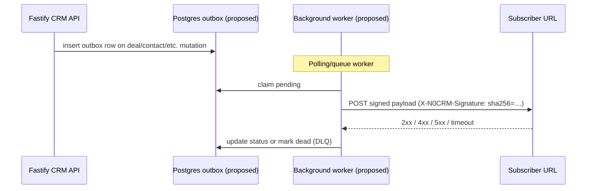

# Pipedrive vs n0CRM — comparison and group-level priorities

This master document compares **Pipedrive** (the group’s reference CRM) with **n0CRM** (this repository), using **official Pipedrive documentation** as an integration benchmark, internal product docs as the n0CRM baseline, and stakeholder input (notably **outbound webhooks** and **high connectivity** to many downstream systems). It is written in **English** and follows repository doc conventions: narrative here; long “shipped” history in [`./master-implementation-history.md`](./master-implementation-history.md); forward execution order in [`./master-roadmap-backlog.md`](./master-roadmap-backlog.md).

---

## Executive summary

- **Pipedrive’s moat for integrators** is a mature **push model** (webhooks v2 with retries, meta payloads, visibility-aware delivery) alongside a **pull model** (documented REST API, marketplace). Teams that run ERP, billing, or RevOps stacks around the CRM depend on that contract.
- **n0CRM** is a **self-hosted monorepo** — a Fastify 5 / Node 22 API (`api/`) over PostgreSQL 16 (postgres.js, `transform: postgres.camel`, behind PgBouncer) with Redis 7 and Socket.io, plus a React 18 + Vite + Zustand + Tailwind SPA (`frontend/`). It ships a strong **in-app** sales stack (deals, contacts, companies, activities, Gmail inbox links, automations, sequences, reports, products/quotes, audit) with **app-layer org scoping** as the authoritative tenant control (RLS is opt-in defense-in-depth — see [`../../docs/adr/0001-tenant-isolation-and-rls.md`](../../docs/adr/0001-tenant-isolation-and-rls.md))—see [`../README.md`](../README.md) and [§ n0CRM capability map](#velo-capability-map).
- The integration surface that used to be the **largest structural gap** has since shipped: **outbound webhook subscriptions** (org-scoped CRUD + HMAC-SHA256 signing + test delivery + secret rotation, `api/src/routes/webhookSubscriptions.ts`), a **public REST write endpoint** (`POST /public/v1/leads`, API-key + scopes, `api/src/routes/publicApi.ts`), and **enterprise identity** (OIDC **SSO** and **SCIM 2.0** provisioning). What remains genuinely open is **event-driven outbound delivery** (an outbox/worker/DLQ pipeline that pushes CRM mutations to subscribers automatically) and a documented **read** REST surface — both tracked in [`./master-roadmap-backlog.md`](./master-roadmap-backlog.md).
- **Recommended remaining lift:** (1) **Event-driven delivery fabric** — an outbox + worker + dead-letter/replay path so deal/contact/company/activity mutations fan out to the existing subscriptions automatically; (2) **read REST + idempotency** to complement the lead-capture write endpoint; (3) **governance v2** (field-level visibility, retention automation) on top of the shipped RBAC, SSO, SCIM, and audit.

---

## Pipedrive integration contract (reference benchmark)

Use this as **acceptance-criteria style benchmarks** for n0CRM design—not a copy of vendor terms. Sources: [Guide for Webhooks v2](https://pipedrive.readme.io/docs/guide-for-webhooks-v2), [Pipedrive API reference](https://developers.pipedrive.com/docs/api).

### Webhooks v2 (outbound from Pipedrive to subscriber URL)

| Benchmark | Pipedrive behavior (summary) | Implication for n0CRM |
|-----------|------------------------------|-------------------------|
| Subscription API | `POST /v1/webhooks` with `subscription_url`, `event_action`, `event_object`, optional `version` (default **2.0**) | Provide org-scoped CRUD for subscriptions; version field in payload |
| URL rules | Public HTTPS URL; **no redirects**; Pipedrive API URLs disallowed as target | Validate URL; reject redirect chains |
| Event model | Actions: `create`, `change`, `delete`, `*`. Objects: `deal`, `person`, `organization`, `activity`, `lead`, `note`, plus pipeline metadata, projects, etc. | Map to CRM entities: deal, contact, company, activity, lead (if present), note |
| Payload | JSON: `meta` (action, entity, ids, timestamp, `attempt`, `correlation_id`, `user_id`, visibility hints, …) + `data` + `previous` on change | Emit stable `meta` + resource snapshot + optional `previous` |
| Success | HTTP **2xx** within ~**10s** | Same for receivers |
| Retries | On failure: additional attempts at **3s, 30s, 150s**; `attempt` in meta | Align backlog: retries + DLQ/replay |
| Health policy | Ban after repeated **first-attempt** failures; subscription **deleted** after **3 days** without success | Define CRM-side policy (softer or similar) + admin alerts |
| Limits | **40** webhooks **per user** (Pipedrive model) | Consider **per organization** limits + fair use |
| Auth to receiver | Optional **HTTP Basic** on subscription | Support Basic + **custom headers** (Bearer, API keys) for Zapier/Make/n8n/ERP |
| Visibility | Optional `user_id` on subscription; events respect that user’s visibility | Map to RLS: only enqueue events for data the acting org/user may see |

### REST API (pull)

Pipedrive exposes broad CRUD and filtering via REST. n0CRM is a **self-hosted Fastify + PostgreSQL** app whose internal CRM routes are JWT-authenticated for the SPA. The **public** product surface for external integrators is currently a **single write endpoint** — `POST /public/v1/leads`, authenticated with `x-api-key` and gated by the `leads:write` scope (see [§ n0CRM capability map](#velo-capability-map)). A broader **read** REST surface (list/get CRUD over deals, contacts, companies, activities) is still open — treat **read REST + keys/scopes** as the remaining Step 2 in [§ Three-step maturity ladder](#three-step-maturity-ladder).

---

## Three-step maturity ladder for n0CRM

1. **Step 1 — Integration fabric:** **Shipped (subscription half).** Outbound **webhook subscriptions** with high **connectivity** — multiple subscriptions per org, HTTPS-only target, sanitized custom headers, **HMAC-SHA256** signing (`X-N0CRM-Signature: sha256=<hex>`), per-subscription secret rotation, test delivery with last-status/response-code logging, SSRF-guarded delivery, and a Settings admin UI (`frontend/src/components/settings/SettingsWebhooksPanel.tsx`). **Still open:** automatic **event-driven delivery** on CRM mutations plus **retries + dead-letter/replay** — roadmap: [`./master-roadmap-backlog.md`](./master-roadmap-backlog.md).
2. **Step 2 — API + reliability parity:** **Partially shipped.** A public **write** endpoint (`POST /public/v1/leads`, API-key + `leads:write` scope) exists; a **read** REST surface for core entities, **idempotency**, and documented limits remain open.
3. **Step 3 — Enterprise motion:** **Largely shipped.** OIDC **SSO** (`/auth/sso` status·start·callback, PKCE, JWKS RS256, JIT provisioning), **SCIM 2.0** user provisioning (`/scim/v2`), server-side **RBAC**, MFA, GDPR export/erasure, and a **security-event audit log** are all live (see [`../../docs/sso-and-scim.md`](../../docs/sso-and-scim.md)). **Governance v2** (field-level visibility, retention automation) is the remaining work.

See also [§ n0CRM webhooks — v1 scope](#webhooks-v1-scope).

---

## n0CRM webhooks — v1 scope and connectivity (“options+”)

### Product intent

Stakeholders want **webhooks with strong connection potential**: a **platform hook**, not one hard-coded integration—so **Zapier, Make, n8n, internal microservices, ERP**, and custom stacks can subscribe with **configuration**, not per-vendor code paths.

### Delivery: shipped today vs. proposed event-driven fabric

**Shipped today (synchronous, request-scoped).** `webhook_subscriptions` + `webhook_subscription_secrets` tables hold org-scoped HTTPS targets, sanitized custom headers, and encrypted signing secrets. The Fastify route (`api/src/routes/webhookSubscriptions.ts`) signs the body with HMAC-SHA256 (`X-N0CRM-Signature: sha256=<hex>`) and POSTs through an SSRF-guarded, DNS-pinned fetch on the `POST /:id/test` action, recording `last_http_status` / `last_delivery_error`. There is **no** outbox table, background worker, or dead-letter queue yet — delivery is synchronous and operator-triggered, not event-driven.

**Proposed (roadmap, not yet built).** To match Pipedrive's push model, CRM mutations would enqueue to an outbox table that a background worker drains with backoff and a dead-letter/replay path:

- In the proposed design, retries use backoff; after max attempts the row is marked **`dead`** (DLQ) with manual replay from Settings → Webhooks. None of the outbox/worker/DLQ/replay components exist in code today — they are tracked in [`./master-roadmap-backlog.md`](./master-roadmap-backlog.md).

### v1 scope — shipped vs. open

| Area | Acceptance criteria | Status |
|------|----------------------|--------|
| Subscriptions | Multiple **active subscriptions per `organization_id`**, each with unique HTTPS URL, enable/disable, display name | **Shipped** (`webhook_subscriptions`) |
| Events (initial set) | At minimum: **deal** created/updated/deleted; **contact** created/updated/deleted; **company** created/updated/deleted; **activity** created/updated/deleted. Use consistent `entity.action` naming (e.g. `deal.updated`). | **Open** — `event_filters` are stored per subscription, but no emitter fans CRM mutations to subscribers yet |
| Filters | **Wildcard or multi-select** subscription filters (e.g. all deal events, or only `deal.deleted`) | **Shipped** (`event_filters` array, default `['*']`) |
| Payload | JSON with **`meta`** + **`data`** (resource fields) + **`previous`** on update when feasible | **Open** — defined by the test payload shape (`event`, `timestamp`, `subscription_id`, `data`); full meta/previous pending event-driven delivery |
| Signing | **HMAC-SHA256** over the body; **secret per subscription**; header is **`X-N0CRM-Signature: sha256=<hex>`** | **Shipped** (per-subscription secret, encrypted at rest, rotatable) |
| Transport | **HTTPS only** (DB CHECK + Zod `startsWith('https://')`); optional **static custom headers** (auth/cookie/forwarding headers stripped via blocklist) | **Shipped** |
| Reliability | **Retries with backoff** + **dead-letter** queue + **manual replay** from admin UI | **Open** — roadmap, no worker/DLQ exists |
| Admin | Settings UI: rotate secret, test delivery, view last status / response code / error | **Shipped** (`SettingsWebhooksPanel.tsx`) |
| Security | **No cross-tenant** delivery (`organization_id` scoped); secrets stored server-side (AES-GCM); SSRF-guarded, DNS-pinned delivery; `webhooks:manage` RBAC on mutating routes | **Shipped** |

### Options+ (phased after v1 — backlog menu)

Capture in roadmap/backlog, not all in v1:

- HTTP **Basic** on subscription (Pipedrive parity)
- **Payload version** toggle (minimal vs enriched nested graph)
- Filters by **pipeline** or **stage** for deal events
- **mTLS** or **OAuth client credentials** to receiver (enterprise)
- **IP allowlist** for related inbound callbacks if introduced later
- **Templates**: “Zapier”, “Slack”, “Generic JSON” presets (pre-filled URL/header patterns)

### Implementation handoff

Record architecture, migrations, and worker/route details in [`./master-implementation-history.md`](./master-implementation-history.md); keep this master as **product + parity** narrative. The subscription tables live in `api/migrations/003_gmail_webhooks_tracking.sql` (`webhook_subscriptions`, `webhook_subscription_secrets`) and the route is `api/src/routes/webhookSubscriptions.ts`. There are **no** Supabase Edge Functions — n0CRM was migrated off Supabase to a self-hosted Fastify API.

---

## Pipedrive — group as-is (capture template)

*Fill after interviews / tenant review. Do not store secrets in git.*

| Field | Value / notes |
|-------|----------------|
| Plan / tier | |
| Active pipelines (count, names) | |
| Key custom fields | |
| Marketplace apps in use | |
| Webhooks (count, primary `event_object` types, target systems) | |
| Critical automations (Workflow Automation) | |
| Reporting / exports to Excel or BI | |

**Interview checklist (30–45 min roles: admin, AE, marketing/RevOps):**

- Which **three screens** do you open daily?
- Which **automations or integrations** are single points of failure?
- Which **three systems** must receive **deal/contact** events (name + URL pattern)?
- What is still **exported** because the CRM does not answer it?

---

## n0CRM — capability map

Aligned to [`../README.md`](../README.md) feature table and [`.planning/CODEBASE.md` — Codebase structure](../.planning/CODEBASE.md#codebase-structure).

| Domain | n0CRM coverage (summary) | Primary code / doc pointers |
|--------|----------------------------|----------------------------|
| Deals / pipeline | Kanban + list, stages in settings, quotes, timeline view | `frontend/src/pages/Deals.tsx`, `frontend/src/store/dealsStore.ts` |
| Contacts / companies | CRUD, detail pages, filters, export | `frontend/src/pages/Contacts.tsx`, `frontend/src/pages/Companies.tsx`, stores |
| Activities | Feed, overdue, link to deals/contacts | `frontend/src/store/activitiesStore.ts` |
| Email | Gmail OAuth, inbox, thread pin/link to CRM | `docs/master-email-operations.md`, `frontend/src/store/emailStore.ts` |
| Automations | Rule engine + triggers from deal flow | `frontend/src/store/automationsStore.ts` |
| Sequences | Enrollments, templates | `frontend/src/store/sequencesStore.ts`, `templateStore` |
| Reports / dashboard | Charts, KPIs, manager metrics | `frontend/src/pages/Reports.tsx`, [`master-implementation-history` — Manager dashboard data contract](./master-implementation-history.md#manager-dashboard-data-contract) |
| Products / quotes | Catalog, quote line items | `frontend/src/store/productsStore.ts` |
| Custom fields | Definitions + renderer | `frontend/src/store/customFieldsStore.ts` |
| Multi-tenancy | `organization_id` app-layer scoping (authoritative); RLS opt-in defense-in-depth | `api/migrations/`, `docs/master-security-compliance.md`, `docs/adr/0001-tenant-isolation-and-rls.md` |
| Audit | Org audit log + security-event log (`security_events`) | `frontend/src/store/auditStore.ts`, `api/migrations/020_security_events.sql` |
| Auth / roles | JWT HS256 (api/src/routes/auth.ts), server-side RBAC, MFA (TOTP), OIDC SSO | `frontend/src/store/authStore.ts`, `frontend/src/components/auth/PermissionGate.tsx`, `api/src/routes/sso.ts` |
| **Outbound webhooks** | **Shipped (subscription half):** org-scoped CRUD, HMAC-SHA256 signing (`X-N0CRM-Signature: sha256=<hex>`), per-subscription rotatable secret, test delivery, SSRF-guarded POST, Settings UI. **Open:** event-driven delivery + retries/DLQ/replay | `api/src/routes/webhookSubscriptions.ts`, `api/migrations/003_gmail_webhooks_tracking.sql`, `frontend/src/components/settings/SettingsWebhooksPanel.tsx` |
| **Public REST API** | **Write endpoint shipped** — `POST /public/v1/leads`, `x-api-key` auth + `leads:write` scope (lead capture into `contacts` as `type='lead'`). **Open:** read CRUD surface | `api/src/routes/publicApi.ts`, `./master-roadmap-backlog.md` |
| **Enterprise identity** | **Shipped** — OIDC SSO (`/auth/sso`), SCIM 2.0 provisioning (`/scim/v2`) | `api/src/routes/sso.ts`, `api/src/routes/scim.ts`, `docs/sso-and-scim.md` |

---

## Comparison matrix (Pipedrive reference vs n0CRM)

**Legend:** **Parity** ≈ comparable depth · **Ahead in n0CRM** · **Critical gap** · **Nice-to-have**

| Area | Capability | Pipedrive (reference) | n0CRM today | Gap | Risk if missing | Effort |
|------|------------|------------------------|---------------|-----|-----------------|--------|
| Pipeline | Visual Kanban, multiple pipelines | Strong | Kanban + configurable stages | **Parity** / partial on multi-pipeline depth | Medium | M |
| Deals | Ownership, history, W/L | Strong | Full deal model + quotes | **Parity** | Low | S |
| Activities | Tasks, calendar sync ecosystem | Strong + integrations | In-app + Gmail context | **Parity** / ecosystem smaller | Medium | M |
| Email | Provider sync breadth | Many native options | Gmail-first, Resend path | **Nice-to-have** (breadth) | Medium | L |
| Reporting | Insights, dashboards | Mature | Reports + manager KPIs | **Parity** / advanced BI varies | Medium | M |
| Automation | Workflow automation | Mature | `automationsStore` | **Parity** / depth TBD | Medium | M |
| Lead capture | Web forms, Leadbooster | Productized | Leads/scoring (see migrations) | **Critical gap** vs full forms product | High for marketing-led | L |
| Documents | Smart Docs, e-sign partners | Partner-heavy | Quote PDF/email in-app | **Nice-to-have** vs partner e-sign | Medium | L |
| Projects | Projects module | Yes | Not a first-class module | **Nice-to-have** unless post-sale is core | Medium | L |
| Mobile | Native apps | Yes | Responsive SPA | **Nice-to-have** | Medium | L |
| **Integrations** | **Outbound webhooks** | **Webhooks v2** (event-driven, retries) | **Subscriptions + HMAC signing + test delivery shipped; event-driven fan-out + DLQ open** | **Partial** (delivery fabric gap) | **Medium** (manual/test delivery works; auto fan-out pending) | **M** |
| **Integrations** | **Public REST** | **Documented CRUD API** | **Write endpoint shipped (`POST /public/v1/leads`, scoped); read CRUD open** | **Partial** | **Medium** | **M** |
| **Integrations** | Marketplace | Large | None | **Nice-to-have** early | Medium | XL |
| Governance | Teams, visibility, SSO/SCIM | Mature | **Server-side RBAC + OIDC SSO + SCIM 2.0 + MFA + audit** (field-level visibility open) | **Parity** on identity; field-level visibility in roadmap | High for enterprise | M |

---

## Top 10 killer gaps (prioritized)

Scoring: **A** adoption / dependency, **R** revenue cycle, **I** integration reliance, **C** switching cost (1–5 each; higher = worse if gap persists). **Score** = sum (max 20). Rows marked **Resolved** / **Mostly resolved** have shipped since the original scoring and are kept for traceability with the residual scope called out.

| # | Gap | A | R | I | C | Score | Response |
|---|-----|---|---|---|---|-------|----------|
| 1 | **Event-driven webhook delivery** (auto fan-out on CRM mutations) — *subscriptions + HMAC signing + test delivery already shipped* | 4 | 3 | 5 | 3 | **15** | **Mostly resolved** — build the emitter + worker on top of existing subscriptions (Step 1 residual) |
| 2 | **Deep ERP/finance** connectors | 3 | 4 | 5 | 4 | **16** | Integration + webhooks |
| 3 | Native **lead forms / routing** (Leadbooster-class) — *`POST /public/v1/leads` capture shipped* | 4 | 5 | 3 | 3 | **15** | Build routing/forms on top of the lead-capture endpoint |
| 4 | **Read REST API** (list/get CRUD) — *write/lead-capture endpoint + keys/scopes shipped* | 3 | 3 | 4 | 3 | **13** | Build read surface (Step 2 residual) |
| 5 | **Idempotency + DLQ** story for async delivery | 3 | 3 | 5 | 4 | **15** | Build with the event-driven delivery fabric |
| 6 | **Marketplace / iPaaS** discoverability | 3 | 2 | 4 | 3 | **12** | Partner strategy |
| 7 | **Mobile / offline** native | 4 | 2 | 2 | 3 | **11** | Nice-to-have / PWA later |
| 8 | **Field-level visibility** | 2 | 2 | 3 | 4 | **11** | Governance v2 |
| 9 | **Projects / post-sale** module | 3 | 3 | 2 | 2 | **10** | Scope decision |
| — | ~~**SSO/SCIM** (enterprise gate)~~ | — | — | — | — | — | **Resolved** — OIDC SSO + SCIM 2.0 shipped (`api/src/routes/sso.ts`, `scim.ts`; `docs/sso-and-scim.md`) |

**Top 3 actions:** (1) Build the **event-driven delivery fabric** (outbox + worker + retries/DLQ) that fans CRM mutations out to the **already-shipped webhook subscriptions** — see [§ n0CRM webhooks — v1 scope](#webhooks-v1-scope). (2) Extend the public surface from lead-capture write to a documented **read REST** CRUD with idempotency. (3) Run **group interviews** and fill [§ Pipedrive — group as-is](#pipedrive-group-as-is) to validate ERP/form priorities.

---

## Where n0CRM is already strong

- **Tenant isolation and security narrative** — app-layer `organization_id` scoping (authoritative), opt-in RLS as defense-in-depth, server-side RBAC, MFA, compliance masters: [`./master-security-compliance.md`](./master-security-compliance.md), [`../../docs/adr/0001-tenant-isolation-and-rls.md`](../../docs/adr/0001-tenant-isolation-and-rls.md).
- **Operator-grade email** — deliverability, tracking, operations: [`./master-email-operations.md`](./master-email-operations.md).
- **In-app velocity** — automations, sequences, manager dashboard, lead scoring maintenance: [`./master-roadmap-backlog.md`](./master-roadmap-backlog.md), [`./master-lead-management.md`](./master-lead-management.md).

---

## Technical appendix — repository pointers

| Topic | Path |
|-------|------|
| Routes / lazy pages | `frontend/src/App.tsx` |
| Deal mutations / automations hook | `frontend/src/store/dealsStore.ts`, `frontend/src/store/automationsStore.ts` |
| Integration audit | `.planning/CODEBASE.md#external-integrations-audit` |
| Schema / migrations | `api/migrations/` |
| Public API route (lead capture, `/public/v1`) | `api/src/routes/publicApi.ts` |
| Outbound webhook subscriptions | `api/src/routes/webhookSubscriptions.ts`, `api/src/routes/webhooks.ts` |
| SSO / SCIM (identity) | `api/src/routes/sso.ts`, `api/src/routes/scim.ts`, `docs/sso-and-scim.md` |
| Structural codebase map | `docs/CODEBASE-MAP.md` |
| Roadmap API/Webhooks | `./master-roadmap-backlog.md` |
| Implementation history (do not duplicate here) | `./master-implementation-history.md` |

---

## Document control

- **Status:** Active  
- **Owner:** Product / Engineering  
- **Last updated:** 2026-06-11  
- **Canonical:** Yes  
