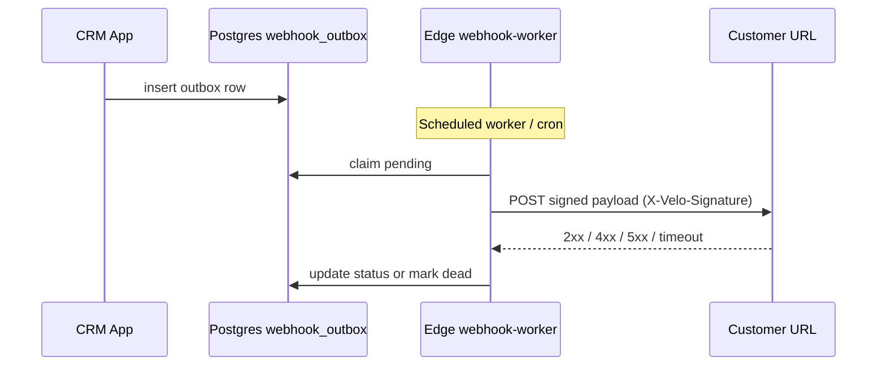

# Pipedrive vs Velo — comparison and group-level priorities

This master document compares **Pipedrive** (the group’s reference CRM) with **Velo** (this repository), using **official Pipedrive documentation** as an integration benchmark, internal product docs as the Velo baseline, and stakeholder input (notably **outbound webhooks** and **high connectivity** to many downstream systems). It is written in **English** and follows repository doc conventions: narrative here; long “shipped” history in [`./master-implementation-history.md`](./master-implementation-history.md); forward execution order in [`./master-roadmap-backlog.md`](./master-roadmap-backlog.md).

---

## Executive summary

- **Pipedrive’s moat for integrators** is a mature **push model** (webhooks v2 with retries, meta payloads, visibility-aware delivery) alongside a **pull model** (documented REST API, marketplace). Teams that run ERP, billing, or RevOps stacks around the CRM depend on that contract.
- **Velo** already ships a strong **in-app** sales stack (deals, contacts, companies, activities, Gmail inbox links, automations, sequences, reports, multi-tenant RLS, audit, products/quotes)—see [`../README.md`](../README.md) and [§ Velo capability map](#velo-capability-map).
- The **largest structural gap** for “group-level” parity is **programmatic integration**: **no product outbound webhooks** today (see [`.planning/CODEBASE.md` — External integrations](../.planning/CODEBASE.md#external-integrations-audit)); the roadmap already tracks **API + Webhooks** and **Webhooks v1 (signed payloads, retries)** in [`./master-roadmap-backlog.md`](./master-roadmap-backlog.md).
- **Recommended lift (three steps):** (1) **Integration fabric** — outbound webhooks with **multi-endpoint subscriptions**, **flexible auth (headers + signing)**, retries/DLQ; (2) **public REST + idempotency**; (3) **enterprise governance** (SSO/SCIM, field visibility, expanded audit) so integrations are controlled.

---

## Pipedrive integration contract (reference benchmark)

Use this as **acceptance-criteria style benchmarks** for Velo design—not a copy of vendor terms. Sources: [Guide for Webhooks v2](https://pipedrive.readme.io/docs/guide-for-webhooks-v2), [Pipedrive API reference](https://developers.pipedrive.com/docs/api).

### Webhooks v2 (outbound from Pipedrive to subscriber URL)

| Benchmark | Pipedrive behavior (summary) | Implication for Velo |
|-----------|------------------------------|-------------------------|
| Subscription API | `POST /v1/webhooks` with `subscription_url`, `event_action`, `event_object`, optional `version` (default **2.0**) | Provide org-scoped CRUD for subscriptions; version field in payload |
| URL rules | Public HTTPS URL; **no redirects**; Pipedrive API URLs disallowed as target | Validate URL; reject redirect chains |
| Event model | Actions: `create`, `change`, `delete`, `*`. Objects: `deal`, `person`, `organization`, `activity`, `lead`, `note`, plus pipeline metadata, projects, etc. | Map to CRM entities: deal, contact, company, activity, lead (if present), note |
| Payload | JSON: `meta` (action, entity, ids, timestamp, `attempt`, `correlation_id`, `user_id`, visibility hints, …) + `data` + `previous` on change | Emit stable `meta` + resource snapshot + optional `previous` |
| Success | HTTP **2xx** within ~**10s** | Same for receivers |
| Retries | On failure: additional attempts at **3s, 30s, 150s**; `attempt` in meta | Align backlog: retries + DLQ/replay |
| Health policy | Ban after repeated **first-attempt** failures; subscription **deleted** after **3 days** without success | Define CRM-side policy (softer or similar) + admin alerts |
| Limits | **40** webhooks **per user** (Pipedrive model) | Consider **per organization** limits + fair use |
| Auth to receiver | Optional **HTTP Basic** on subscription | Support Basic + **custom headers** (Bearer, API keys) for Zapier/Make/n8n/ERP |
| Visibility | Optional `user_id` on subscription; events respect that user’s visibility | Map to RLS: only enqueue events for data the acting org/user may see |

### REST API (pull)

Pipedrive exposes broad CRUD and filtering via REST. Velo today is primarily **Supabase-backed app + RLS** without a **documented public REST** product surface for external integrators—treat **public API + keys/scopes** as Step 2 in [§ Three-step maturity ladder](#three-step-maturity-ladder).

---

## Three-step maturity ladder for Velo

1. **Step 1 — Integration fabric (P0):** Outbound **webhooks** with high **connectivity** (multiple subscriptions per org, HTTPS, custom headers, signed payloads, retries, delivery logs, admin UI). Minimal **inbound** endpoints only where already required (e.g. OAuth). Roadmap: [`./master-roadmap-backlog.md`](./master-roadmap-backlog.md) (API + Webhooks, replay/dead-letter).
2. **Step 2 — API + reliability parity:** Stable **REST** for core entities, **idempotency**, documented limits, same reliability primitives as webhooks where async.
3. **Step 3 — Enterprise motion:** **SSO/SCIM readiness**, **governance v2** (field-level visibility, retention automation), **expanded audit** for admin and integration actions—so webhooks and API keys are governable.

See also [§ Velo webhooks — v1 scope](#webhooks-v1-scope).

---

## Velo webhooks — v1 scope and connectivity (“options+”)

### Product intent

Stakeholders want **webhooks with strong connection potential**: a **platform hook**, not one hard-coded integration—so **Zapier, Make, n8n, internal microservices, ERP**, and custom stacks can subscribe with **configuration**, not per-vendor code paths.

### Delivery flow (outbox → worker → DLQ)

- Retries use backoff; after max attempts the row is marked **`dead`** (DLQ). Operators can replay from Settings → Webhooks (subscription test / replay actions) via `webhook-subscriptions` actions (`listFailedOutbox` / `replayOutbox`).

### v1 (ship first)

| Area | Acceptance criteria |
|------|----------------------|
| Subscriptions | Multiple **active subscriptions per `organization_id`**, each with unique HTTPS URL, enable/disable, display name |
| Events (initial set) | At minimum: **deal** created/updated/deleted; **contact** created/updated/deleted; **company** created/updated/deleted; **activity** created/updated/deleted. Use consistent `entity.action` naming (e.g. `deal.updated`). |
| Filters | **Wildcard or multi-select** subscription filters (e.g. all deal events, or only `deal.deleted`) |
| Payload | JSON with **`meta`** (`event_id`, `event`, `organization_id`, `timestamp`, `schema_version`, `delivery_attempt`, optional `actor_user_id`) + **`data`** (resource fields) + **`previous`** on update when feasible |
| Signing | **HMAC-SHA256** (or documented equivalent) over canonical body; **secret per subscription**; header name documented (e.g. `X-Velo-Signature`) |
| Transport | **HTTPS only**; optional **static custom headers** (e.g. `Authorization: Bearer …`, `X-Api-Key`) for downstream auth |
| Reliability | **Retries with backoff** + **dead-letter** queue + **manual replay** from admin UI (align [`./master-roadmap-backlog.md`](./master-roadmap-backlog.md)) |
| Admin | Settings (or dedicated) UI: create secret, rotate secret, test delivery, view last status / response code / latency |
| Security | **No cross-tenant** delivery; secrets stored server-side; rate limit subscription CRUD |
| Static egress IPs | Document **only if** the deployment can guarantee fixed egress; otherwise contract is **URL + HMAC + optional headers** |

### Options+ (phased after v1 — backlog menu)

Capture in roadmap/backlog, not all in v1:

- HTTP **Basic** on subscription (Pipedrive parity)
- **Payload version** toggle (minimal vs enriched nested graph)
- Filters by **pipeline** or **stage** for deal events
- **mTLS** or **OAuth client credentials** to receiver (enterprise)
- **IP allowlist** for related inbound callbacks if introduced later
- **Templates**: “Zapier”, “Slack”, “Generic JSON” presets (pre-filled URL/header patterns)

### Implementation handoff

When code ships, record architecture, migrations, and Edge Functions in [`./master-implementation-history.md`](./master-implementation-history.md); keep this master as **product + parity** narrative.

---

## Pipedrive — group as-is (capture template)

*Fill after interviews / tenant review. Do not store secrets in git.*

| Field | Value / notes |
|-------|----------------|
| Plan / tier | |
| Active pipelines (count, names) | |
| Key custom fields | |
| Marketplace apps in use | |
| Webhooks (count, primary `event_object` types, target systems) | |
| Critical automations (Workflow Automation) | |
| Reporting / exports to Excel or BI | |

**Interview checklist (30–45 min roles: admin, AE, marketing/RevOps):**

- Which **three screens** do you open daily?
- Which **automations or integrations** are single points of failure?
- Which **three systems** must receive **deal/contact** events (name + URL pattern)?
- What is still **exported** because the CRM does not answer it?

---

## Velo — capability map

Aligned to [`../README.md`](../README.md) feature table and [`.planning/CODEBASE.md` — Codebase structure](../.planning/CODEBASE.md#codebase-structure).

| Domain | Velo coverage (summary) | Primary code / doc pointers |
|--------|----------------------------|----------------------------|
| Deals / pipeline | Kanban + list, stages in settings, quotes, timeline view | `frontend/src/pages/Deals.tsx`, `frontend/src/store/dealsStore.ts` |
| Contacts / companies | CRUD, detail pages, filters, export | `frontend/src/pages/Contacts.tsx`, `frontend/src/pages/Companies.tsx`, stores |
| Activities | Feed, overdue, link to deals/contacts | `frontend/src/store/activitiesStore.ts` |
| Email | Gmail OAuth, inbox, thread pin/link to CRM | `docs/master-email-operations.md`, `frontend/src/store/emailStore.ts` |
| Automations | Rule engine + triggers from deal flow | `frontend/src/store/automationsStore.ts` |
| Sequences | Enrollments, templates | `frontend/src/store/sequencesStore.ts`, `templateStore` |
| Reports / dashboard | Charts, KPIs, manager metrics | `frontend/src/pages/Reports.tsx`, [`master-implementation-history` — Manager dashboard data contract](./master-implementation-history.md#manager-dashboard-data-contract) |
| Products / quotes | Catalog, quote line items | `frontend/src/store/productsStore.ts` |
| Custom fields | Definitions + renderer | `frontend/src/store/customFieldsStore.ts` |
| Multi-tenancy | `organization_id`, RLS | `api/migrations/`, `docs/master-security-compliance.md` |
| Audit | Org audit log | `frontend/src/store/auditStore.ts` |
| Auth / roles | JWT HS256 (api/src/routes/auth.ts), permission gates | `frontend/src/store/authStore.ts`, `frontend/src/components/auth/PermissionGate.tsx` |
| **Outbound webhooks** | **Shipped** (subscriptions, HMAC `X-Velo-Signature`, outbox, worker, Settings UI) — replay failed rows via settings | `api/migrations/20260420140000_webhooks_outbound.sql`, `20260424120000_webhook_delete_payload_api_keys_lead_capture.sql` |
| **Public REST API** | **Phase 1 (read-only) shipped** — org-scoped API keys + `/public/v1/*` routes; see `docs/public-api-phase1.md` | `api/src/routes/public/`, `./master-roadmap-backlog.md` |

---

## Comparison matrix (Pipedrive reference vs Velo)

**Legend:** **Parity** ≈ comparable depth · **Ahead in Velo** · **Critical gap** · **Nice-to-have**

| Area | Capability | Pipedrive (reference) | Velo today | Gap | Risk if missing | Effort |
|------|------------|------------------------|---------------|-----|-----------------|--------|
| Pipeline | Visual Kanban, multiple pipelines | Strong | Kanban + configurable stages | **Parity** / partial on multi-pipeline depth | Medium | M |
| Deals | Ownership, history, W/L | Strong | Full deal model + quotes | **Parity** | Low | S |
| Activities | Tasks, calendar sync ecosystem | Strong + integrations | In-app + Gmail context | **Parity** / ecosystem smaller | Medium | M |
| Email | Provider sync breadth | Many native options | Gmail-first, Resend path | **Nice-to-have** (breadth) | Medium | L |
| Reporting | Insights, dashboards | Mature | Reports + manager KPIs | **Parity** / advanced BI varies | Medium | M |
| Automation | Workflow automation | Mature | `automationsStore` | **Parity** / depth TBD | Medium | M |
| Lead capture | Web forms, Leadbooster | Productized | Leads/scoring (see migrations) | **Critical gap** vs full forms product | High for marketing-led | L |
| Documents | Smart Docs, e-sign partners | Partner-heavy | Quote PDF/email in-app | **Nice-to-have** vs partner e-sign | Medium | L |
| Projects | Projects module | Yes | Not a first-class module | **Nice-to-have** unless post-sale is core | Medium | L |
| Mobile | Native apps | Yes | Responsive SPA | **Nice-to-have** | Medium | L |
| **Integrations** | **Outbound webhooks** | **Webhooks v2** | **None (product)** | **Critical gap** | **Very high** for group ERP/RevOps | **L** |
| **Integrations** | **Public REST** | **Documented API** | **Supabase direct (not product API)** | **Critical gap** | **High** | **L** |
| **Integrations** | Marketplace | Large | None | **Nice-to-have** early | Medium | XL |
| Governance | Teams, visibility | Mature | RLS + roles | **Parity** / enterprise features in roadmap | High for enterprise | M |

---

## Top 10 killer gaps (prioritized)

Scoring: **A** adoption / dependency, **R** revenue cycle, **I** integration reliance, **C** switching cost (1–5 each; higher = worse if gap persists). **Score** = sum (max 20).

| # | Gap | A | R | I | C | Score | Response |
|---|-----|---|---|---|---|-------|----------|
| 1 | **Outbound webhooks** (signed, retries, multi-subscription) | 5 | 4 | 5 | 5 | **19** | **Build in Velo** (Step 1) |
| 2 | **Public REST API** + keys/scopes | 4 | 4 | 5 | 4 | **17** | Build (Step 2) |
| 3 | **Deep ERP/finance** connectors | 3 | 4 | 5 | 4 | **16** | Integration + webhooks |
| 4 | **Idempotency + DLQ** story for async | 3 | 3 | 5 | 4 | **15** | Build with webhooks |
| 5 | Native **lead forms / routing** (Leadbooster-class) | 4 | 5 | 3 | 3 | **15** | Build or integrate |
| 6 | **SSO/SCIM** (enterprise gate) | 3 | 2 | 4 | 5 | **14** | Roadmap 31–60 |
| 7 | **Marketplace / iPaaS** discoverability | 3 | 2 | 4 | 3 | **12** | Partner strategy |
| 8 | **Mobile / offline** native | 4 | 2 | 2 | 3 | **11** | Nice-to-have / PWA later |
| 9 | **Field-level visibility** | 2 | 2 | 3 | 4 | **11** | Governance v2 |
| 10 | **Projects / post-sale** module | 3 | 3 | 2 | 2 | **10** | Scope decision |

**Top 3 actions:** (1) Ship **webhooks v1** with connectivity options in [§ Velo webhooks — v1 scope](#webhooks-v1-scope). (2) Plan **public REST** surface and auth. (3) Run **group interviews** and fill [§ Pipedrive — group as-is](#pipedrive-group-as-is) to validate ERP/form priorities.

---

## Where Velo is already strong

- **Tenant isolation and security narrative** — RLS, channel gates, compliance masters: [`./master-security-compliance.md`](./master-security-compliance.md).
- **Operator-grade email** — deliverability, tracking, operations: [`./master-email-operations.md`](./master-email-operations.md).
- **In-app velocity** — automations, sequences, manager dashboard, lead scoring maintenance: [`./master-roadmap-backlog.md`](./master-roadmap-backlog.md), [`./master-lead-management.md`](./master-lead-management.md).

---

## Technical appendix — repository pointers

| Topic | Path |
|-------|------|
| Routes / lazy pages | `frontend/src/App.tsx` |
| Deal mutations / automations hook | `frontend/src/store/dealsStore.ts`, `frontend/src/store/automationsStore.ts` |
| Integration audit | `.planning/CODEBASE.md#external-integrations-audit` |
| Schema / migrations | `api/migrations/` |
| Public API routes | `api/src/routes/public/` |
| Roadmap API/Webhooks | `./master-roadmap-backlog.md` |
| Implementation history (do not duplicate here) | `./master-implementation-history.md` |

---

## Document control

- **Status:** Active  
- **Owner:** Product / Engineering  
- **Last updated:** 2026-05-18  
- **Canonical:** Yes  
